# CTrackr - Job Application Tracker

A comprehensive full-stack application for tracking job applications and managing user profiles. Built with React, TypeScript, AWS Serverless Architecture, and Infrastructure as Code.

## 💡 Why This Project?

I built CTrackr to replace spreadsheets and manual tracking for job applications with a secure, scalable, cloud-native system. It focuses on real requirements like status tracking, profile-driven document management, and integration with AWS services for resilient infrastructure.

This project demonstrates:
- **Full-stack development** with modern React and TypeScript
- **Serverless architecture** using AWS Lambda, API Gateway, and DynamoDB
- **Infrastructure as Code** with Terraform for reproducible deployments (applied manually when infrastructure changes)
- **Continuous delivery** for the static frontend via GitHub Actions (build → S3 → CloudFront invalidation)
- **Production-ready features** including authentication, file management, user data isolation, and AI-assisted documents
- **Best practices** in security, scalability, and maintainability

## 🚀 Features

### Job Application Management
- **CRUD Operations**: Create, read, update, and delete job applications
- **Status Tracking**: Full lifecycle including Applied, Interview, Offer, Rejected, Withdrawn, and Accepted
- **Dashboard Filters**: Status tabs (including “Active” for in-progress pipelines), search by company/position, and applied-date range
- **CSV Export**: Download the current filtered list as a UTF-8 CSV for reporting
- **Client-Side Cache**: Recent application lists are cached locally for faster loads, with background refresh
- **Detailed Information**: Store company details, position, salary, location, contact information, job URL, notes, job description, and requirements
- **Interview Management**: Track interview dates, times, places, and links
- **File Attachments**: Upload and manage CV and cover letter files; optional **version history** per document (uploaded vs AI-generated)
- **Job Posting URL**: Paste a job URL to **extract** structured fields (company, role, description, requirements, contacts) via the backend
- **Match Score**: AI-assisted **fit score** and narrative (strengths/gaps) comparing your profile to the role
- **S3 File Management**: Automatic file deletion when applications are removed; cleanup paths for generated documents when appropriate

### User Profile Management
- **Comprehensive Profile**: Manage personal information, contact details, and professional links
- **Categorized Skills**: Organize technical skills by categories with descriptions
- **Work Experience**: Track employment history with detailed descriptions
- **Education**: Manage educational background
- **Certifications**: Store professional certifications
- **Projects**: Showcase academic and technical projects with achievements
- **Languages**: Track language proficiencies
- **PDF Generation**: Generate professional CV/Resume PDFs from profile data (client-side)

### AI-Assisted Documents & Job Insights
- **AWS Bedrock**: Server-side CV and cover letter generation (structured prompts, PDF output, upload to S3)
- **Generate Documents UI**: Routes `/applications/:id/generate` and `/generate-documents` for tailoring documents to a specific application
- **Inline Generation**: Generate CV/cover letter while creating or editing an application, with version tracking
- **ATS-Oriented Output**: Prompts emphasize clear structure and role-relevant keywords from your profile and the job text
- **Context-Aware**: Uses job description, requirements, and parsed job metadata when available

### Authentication & Security
- **AWS Cognito Integration**: Secure user authentication and authorization
- **Email Verification**: Email-based account verification via AWS SES
- **Protected Routes**: Secure access to application features
- **User-Specific Data**: All data is isolated per user

## 🏗️ Architecture

### Frontend
- **Framework**: React 18 + TypeScript
- **Build Tool**: Vite
- **Routing**: React Router
- **State Management**: React Context API
- **UI Components**: Custom components with modern CSS
- **PDF Generation**: jsPDF for client-side PDF generation
- **Authentication**: AWS Amplify (Cognito)

### Backend (Serverless)
- **Compute**: AWS Lambda (Node.js 20)
- **API**: AWS API Gateway (HTTP API)
- **Database**: AWS DynamoDB
- **File Storage**: AWS S3
- **Generative AI**: Amazon Bedrock (foundation models for document generation, job parsing, and match scoring)
- **CDN**: AWS CloudFront
- **DNS**: AWS Route 53
- **SSL/TLS**: AWS Certificate Manager (ACM)
- **Email**: AWS SES (Simple Email Service)
- **Authentication**: AWS Cognito

### Infrastructure
- **IaC**: Terraform (infrastructure and Lambda packaging; run locally or in your pipeline when you change backend/IaC)
- **CI/CD**: GitHub Actions deploys the **Vite frontend** to S3 and invalidates CloudFront on pushes to `main` (Terraform is **not** part of this workflow)
- **Region**: ca-central-1 (primary), us-east-1 (CloudFront certificates)
- **Domain**: Custom domain support via Route 53

## 📁 Project Structure

```
CTrackr/
├── src/                          # React frontend source
│   ├── components/              # Reusable React components
│   │   ├── Layout.tsx          # Main layout with navigation
│   │   └── ProtectedRoute.tsx  # Route protection component
│   ├── pages/                   # Page components (with co-located CSS where used)
│   │   ├── Home.tsx            # Landing page
│   │   ├── Login.tsx           # Authentication page
│   │   ├── Applications.tsx    # Application list (filters, export, cache)
│   │   ├── ApplicationDetail.tsx # Application detail page
│   │   ├── NewApplication.tsx  # Create/edit application (uploads, AI generation, job URL)
│   │   ├── GenerateDocuments.tsx # AI CV / cover letter generation flow
│   │   └── Profile.tsx         # User profile management
│   ├── contexts/                # React contexts
│   │   └── AuthContext.tsx     # Authentication context
│   ├── utils/                   # Utility functions
│   │   ├── api.ts              # API client functions
│   │   ├── auth.ts             # Authentication utilities
│   │   └── date.ts             # Date formatting helpers for display and filters
│   ├── types/                   # TypeScript type definitions
│   │   ├── application.ts      # Application types (statuses, versions, parsed job)
│   │   └── user.ts             # User profile types
│   └── vite-env.d.ts           # Vite environment types
├── lambda/                       # AWS Lambda functions
│   ├── create-application/     # Create new application
│   ├── get-application/        # Get single application
│   ├── list-applications/      # List applications (with user filtering)
│   ├── update-application/     # Update application
│   ├── delete-application/     # Delete application + S3 files
│   ├── get-job-info/           # Extract job fields from a posting URL (Bedrock)
│   ├── match-score/            # Profile vs job fit score (Bedrock)
│   ├── generate-documents/     # Generate CV / cover letter PDFs (Bedrock + S3)
│   ├── get-profile/            # Get user profile
│   ├── update-profile/         # Update user profile
│   ├── get-upload-url/         # Generate S3 presigned URLs
│   └── delete-file/            # Delete files from S3
├── terraform/                    # Infrastructure as Code
│   ├── main.tf                 # Main Terraform configuration
│   ├── variables.tf            # Variable definitions
│   ├── outputs.tf              # Output values
│   └── terraform.tfvars.example # Example configuration
├── public/                       # Static assets
│   └── logo.svg                # Application logo
├── screenshots/                  # README screenshots (optional)
├── .github/workflows/            # CI/CD: frontend deploy to S3 + CloudFront
└── package.json                 # Frontend dependencies
```

## 🛠️ Setup & Installation

### Prerequisites

- **Node.js**: 18+ (for frontend and Lambda functions)
- **AWS CLI**: Configured with appropriate credentials
- **Terraform**: >= 1.0
- **Git**: For version control
- **AWS Account**: With appropriate permissions
- **Domain**: (Optional) For custom domain setup

### Installation Steps

1. **Clone the repository:**
```bash
git clone https://github.com/SinanCirak/CTrackr.git
cd CTrackr
```

2. **Install frontend dependencies:**
```bash
npm install
```

3. **Install Lambda function dependencies:**
```bash
cd lambda/create-application && npm install && cd ../..
cd lambda/get-application && npm install && cd ../..
cd lambda/list-applications && npm install && cd ../..
cd lambda/update-application && npm install && cd ../..
cd lambda/delete-application && npm install && cd ../..
cd lambda/get-profile && npm install && cd ../..
cd lambda/update-profile && npm install && cd ../..
cd lambda/get-upload-url && npm install && cd ../..
cd lambda/delete-file && npm install && cd ../..
cd lambda/get-job-info && npm install && cd ../..
cd lambda/match-score && npm install && cd ../..
cd lambda/generate-documents && npm install && cd ../..
```

4. **Configure Terraform variables:**
```bash
cd terraform
cp terraform.tfvars.example terraform.tfvars
# Edit terraform.tfvars with your AWS details:
# - aws_region: ca-central-1
# - domain_name: your-domain.com (optional)
# - ses_sender_email: your-verified-email@domain.com
```

5. **Deploy infrastructure:**
```bash
terraform init
terraform plan
terraform apply
```

6. **Configure frontend environment:**
After deployment, create a `.env` file in the root directory:
```bash
VITE_API_BASE_URL=https://your-api-gateway-url.execute-api.ca-central-1.amazonaws.com
VITE_COGNITO_USER_POOL_ID=ca-central-1_xxxxx
VITE_COGNITO_USER_POOL_CLIENT_ID=xxxxx
VITE_AWS_REGION=ca-central-1
```

7. **Build and deploy frontend:**
```bash
npm run build
# Upload to S3 (bucket name from Terraform outputs)
aws s3 sync dist/ s3://ctrackr-website-prod --delete
# Invalidate CloudFront cache
aws cloudfront create-invalidation --distribution-id YOUR_DISTRIBUTION_ID --paths "/*"
```

## 🚀 Development

### Start Development Server

```bash
npm run dev
```

The application will be available at `http://localhost:5173`

### Environment Variables

Create a `.env` file in the root directory:

```env
VITE_API_BASE_URL=https://your-api-gateway-url.execute-api.ca-central-1.amazonaws.com
VITE_COGNITO_USER_POOL_ID=your-user-pool-id
VITE_COGNITO_USER_POOL_CLIENT_ID=your-client-id
VITE_AWS_REGION=ca-central-1
```

## 📡 API Endpoints

### Applications
- `POST /applications` - Create a new job application
- `GET /applications?userId={userId}` - List applications (filtered by user)
- `GET /applications/{id}` - Get a specific application
- `PUT /applications/{id}` - Update an application
- `DELETE /applications/{id}` - Delete an application and associated S3 files

### Job insights & AI documents
- `POST /job-info` - Extract structured fields from a job posting URL  
  - Body: `{ jobUrl }`
- `POST /match-score` - Score how well a user profile matches a job application payload  
  - Body: `{ userProfile, jobApplication }`
- `POST /generate-documents` - Generate CV or cover letter PDF (uploads to S3; returns URLs/keys)  
  - Body: `{ userProfile, jobApplication, documentType, timezoneOffset }` (and related fields as implemented)

### Profile
- `GET /profile?userId={userId}` - Get user profile
- `PUT /profile?userId={userId}` - Update user profile

### File Management
- `POST /upload-url` - Generate presigned URL for S3 upload
  - Body: `{ fileName, fileType, userId, companyName, fileCategory, timezoneOffset }`
  - Returns: `{ uploadUrl, fileUrl, fileKey }`
- `DELETE /file` - Delete file from S3
  - Body: `{ fileKey }`

## 🗄️ Database Schema

### DynamoDB Tables

#### Applications Table (`ctrackr-applications`)
- **Partition Key**: `id` (String)
- **Attributes**:
  - `userId` (String) - User identifier
  - `company` (String) - Company name
  - `position` (String) - Job position
  - `status` (String) - Application status
  - `appliedDate` (String) - Application date
  - `cvUrl` (String) - CV file URL
  - `cvFileKey` (String) - S3 key for CV file
  - `coverLetterUrl` (String) - Cover letter file URL
  - `coverLetterFileKey` (String) - S3 key for cover letter file
  - `jobDescription` (String) - Job description text when captured
  - `requirements` (String) - Requirements / qualifications text when captured
  - `cvVersions` / `coverLetterVersions` (List) - Optional per-document version history (uploaded vs generated)
  - `parsedJob` (Map) - Optional structured metadata from job URL parsing / AI prep
  - `createdAt` (String) - Creation timestamp
  - `updatedAt` (String) - Last update timestamp
  - And more...

#### User Profiles Table (`ctrackr-user-profiles`)
- **Partition Key**: `userId` (String)
- **Attributes**:
  - `fullName` (String)
  - `email` (String)
  - `phone` (String)
  - `address` (String)
  - `linkedinUrl` (String)
  - `githubUrl` (String)
  - `portfolioUrl` (String)
  - `summary` (String)
  - `skillCategories` (List) - Categorized skills
  - `experience` (List) - Work experience
  - `education` (List) - Education history
  - `certifications` (List) - Certifications
  - `projects` (List) - Projects
  - `languages` (List) - Languages
  - `createdAt` (String)
  - `updatedAt` (String)

## 📦 S3 Bucket Structure

### Website Bucket (`ctrackr-website-prod`)
- Static website files (HTML, CSS, JS)
- Served via CloudFront CDN
- Origin Access Control (OAC) for secure access

### Uploads Bucket (`ctrackr-uploads-prod`)
- User-uploaded files organized by user ID
- Structure: `{userId}/{fileCategory}_{companyName}_{DDMMYYYY}_{HHMM}.{ext}`
- Example: `user-123/CV_Google_07012026_1615.pdf`
- Versioning enabled
- CORS configured for browser uploads

## ☁️ AWS Services & Resources

### Authentication & User Management
- **AWS Cognito**:
  - **User Pool** (`${project_name}-user-pool`):
    - Email-based authentication
    - Auto-verified email attributes
    - Password policy (min 8 chars, uppercase, lowercase, numbers, symbols)
    - Account recovery via verified email
    - Email verification with custom templates
    - Email sending via AWS SES
  - **User Pool Client** (`${project_name}-client`):
    - OAuth 2.0 flows (code, implicit)
    - OAuth scopes (email, openid, profile)
    - Callback URLs for domain and localhost
    - Logout URLs configured
    - User password authentication enabled
    - Refresh token authentication enabled
  - **User Pool Domain** (`${project_name}-auth`):
    - Hosted UI for authentication
    - Custom domain support (if domain provided)

### Compute & API
- **AWS Lambda** (12 functions):
  - `create-application` - Create new job applications
  - `get-application` - Retrieve single application
  - `list-applications` - List applications with user filtering
  - `update-application` - Update application details
  - `delete-application` - Delete application and S3 files
  - `get-job-info` - Extract job fields from a posting URL (Bedrock)
  - `match-score` - Profile vs job fit score and narrative (Bedrock)
  - `generate-documents` - Generate CV / cover letter PDFs (Bedrock, S3 upload)
  - `get-profile` - Get user profile
  - `update-profile` - Update user profile
  - `get-upload-url` - Generate S3 presigned URLs
  - `delete-file` - Delete files from S3
- **AWS API Gateway** (HTTP API):
  - 12 API routes (applications, profile, uploads, job-info, match-score, generate-documents)
  - CORS enabled
  - Auto-deploy stage
  - Lambda integrations

### Database
- **AWS DynamoDB** (2 tables):
  - `ctrackr-applications` - Job applications data
  - `ctrackr-user-profiles` - User profile data
  - Pay-per-request billing mode

### Storage
- **AWS S3** (2 buckets):
  - `ctrackr-website-prod` - Frontend static files
    - Website configuration
    - Public access block (CloudFront only)
    - Bucket policy for CloudFront OAC
  - `ctrackr-uploads-prod` - User file uploads
    - CORS configuration
    - Versioning enabled

### Content Delivery
- **AWS CloudFront**:
  - Distribution for website bucket
  - Origin Access Control (OAC)
  - Custom domain support
  - SSL/TLS via ACM
  - IPv4 and IPv6 support

### Networking & DNS
- **AWS Route 53**:
  - Hosted zone lookup
  - A record for CloudFront
  - AAAA record for IPv6
  - CNAME records for certificate validation
- **AWS Certificate Manager (ACM)**:
  - SSL/TLS certificate for CloudFront
  - Certificate validation via Route 53
  - Region: us-east-1 (required for CloudFront)

### Email
- **AWS SES (Simple Email Service)**:
  - Email identity for Cognito
  - Email verification codes
  - Account recovery emails

### Security & Access
- **AWS IAM**:
  - Lambda execution role
  - IAM role policy for:
    - DynamoDB access (applications & user_profiles tables)
    - S3 access (uploads bucket)
    - Bedrock access (for AI-assisted document generation)
- **Lambda Permissions**:
  - API Gateway invoke permissions for all Lambda functions

### Infrastructure as Code
- **Terraform Providers**:
  - AWS Provider (v5.0+)
  - Archive Provider (for Lambda packaging)
- **Terraform Resources**: 71+ resources
- **Terraform Data Sources**: 10+ data sources

## 🔐 Security Features

- **AWS Cognito**: User authentication and authorization
- **IAM Roles**: Least privilege access for Lambda functions
- **S3 Bucket Policies**: Secure file access via presigned URLs
- **CORS Configuration**: Proper CORS setup for API Gateway and S3
- **Origin Access Control**: CloudFront OAC for S3 access
- **User Data Isolation**: All queries filtered by userId
- **Password Policy**: Strong password requirements via Cognito
- **Email Verification**: Secure email-based verification

## 🖥️ User Interface

### Screenshots

#### Home Page
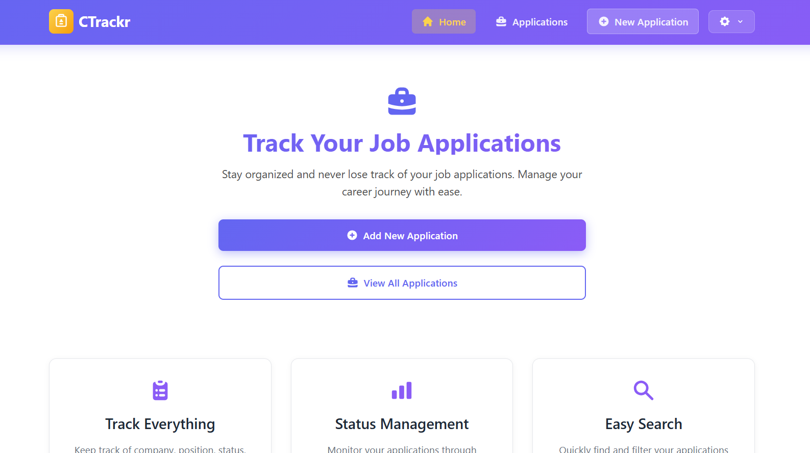
*Landing page with hero section, feature highlights, and call-to-action buttons*

#### Applications Dashboard
The list view combines **status tabs** (including Active), **search** by company or position, an **applied-date range** (from / to), and **CSV export** of whatever is currently shown.

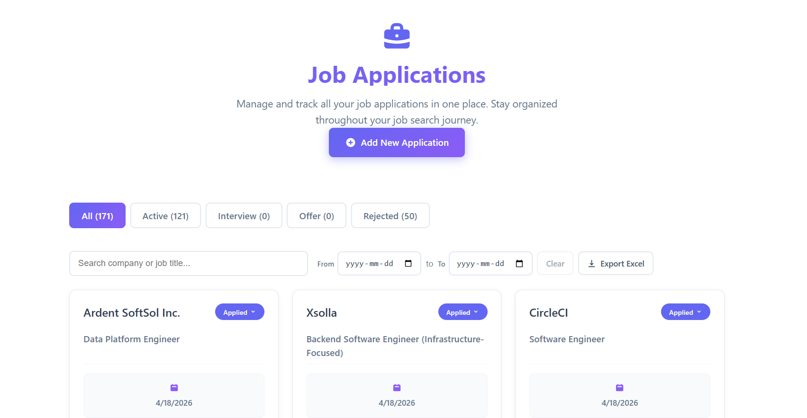
*Applications dashboard with summary statistics and application cards*

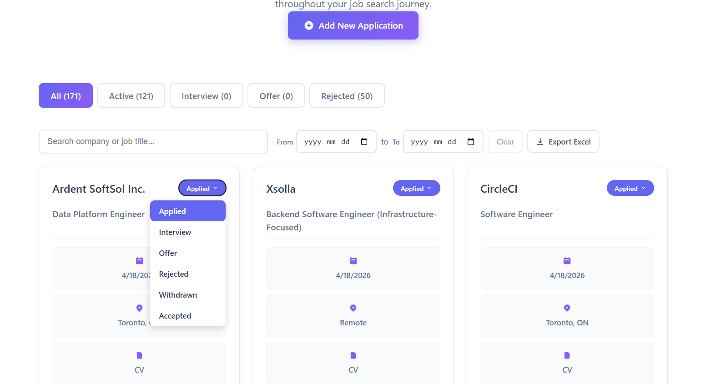
*Filtered list (e.g. by status); the same toolbar also supports search, date range, and export*

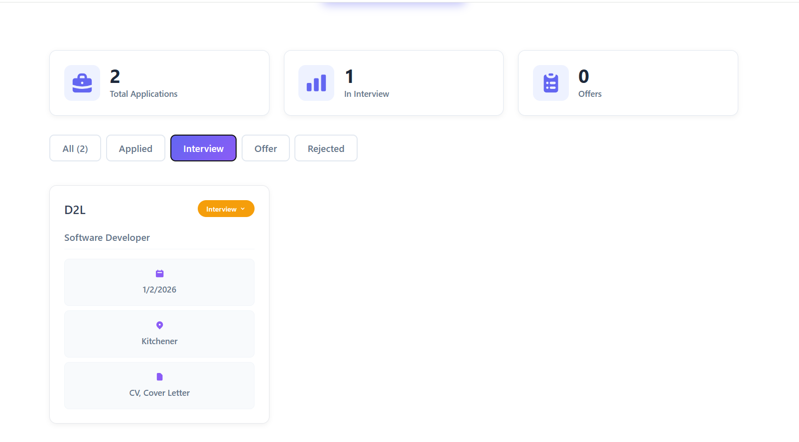
*Status filters together with search, applied-date range, and CSV export*

#### New Application Form
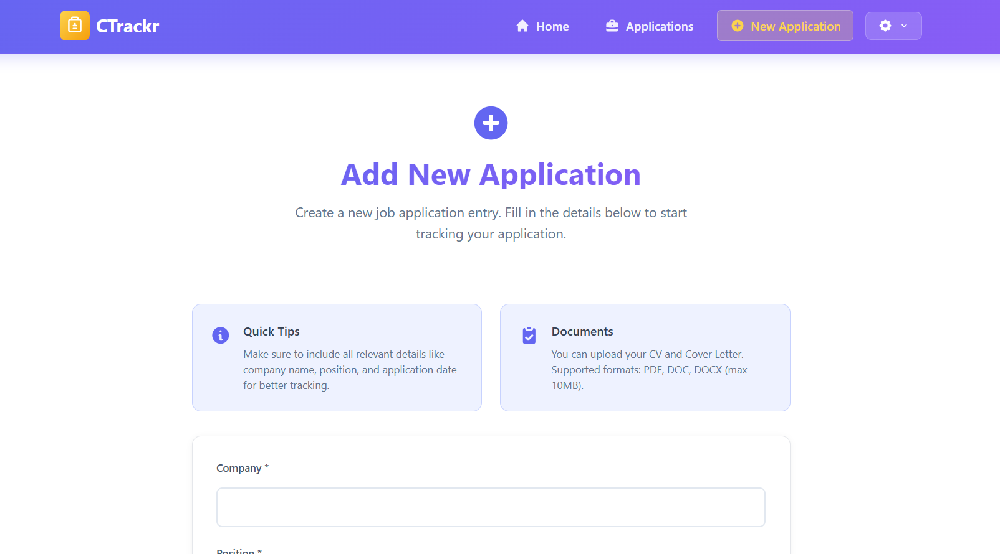
*Main form fields for company, position, dates, and contact information*

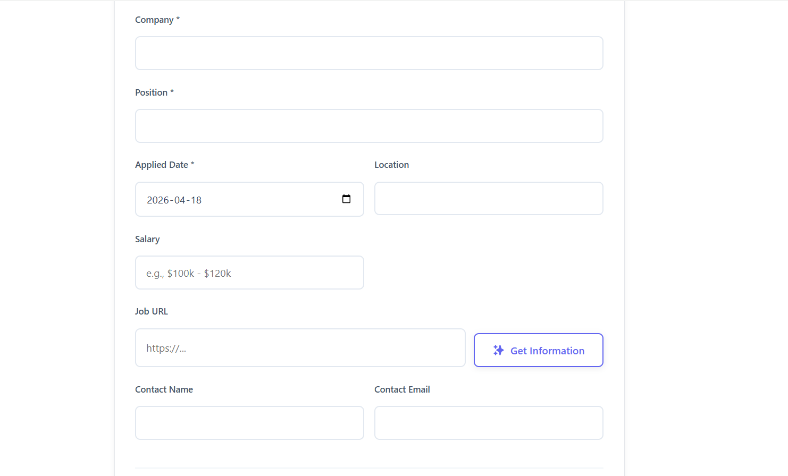
*Job posting URL and Get Information control to extract fields from the listing*

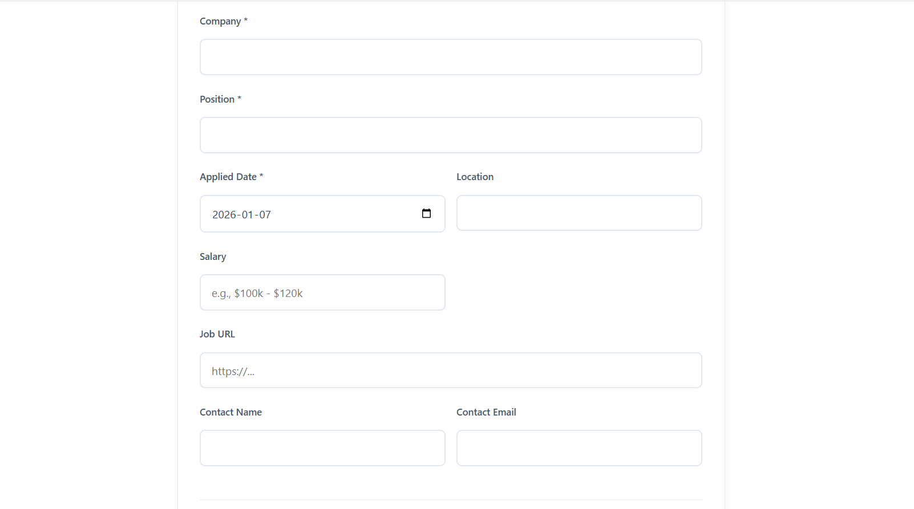
*Job details section with description and requirements fields*

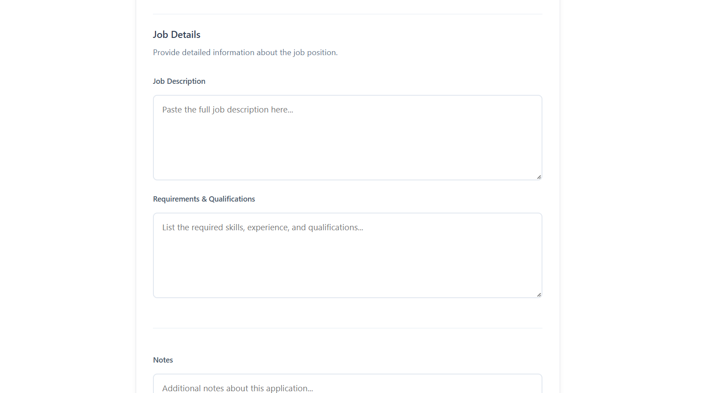
*Notes section for additional application information*

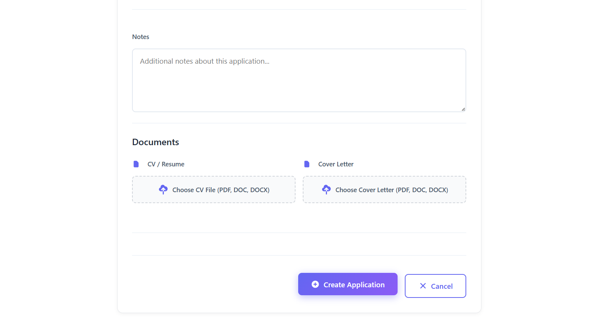
*File upload section for CV and Cover Letter*

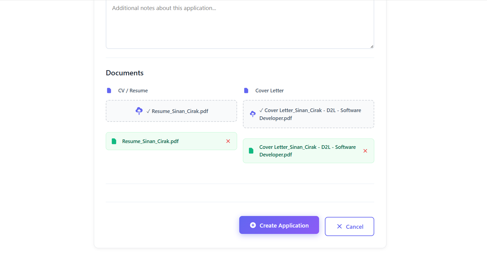
*Documents section with uploaded files displayed*

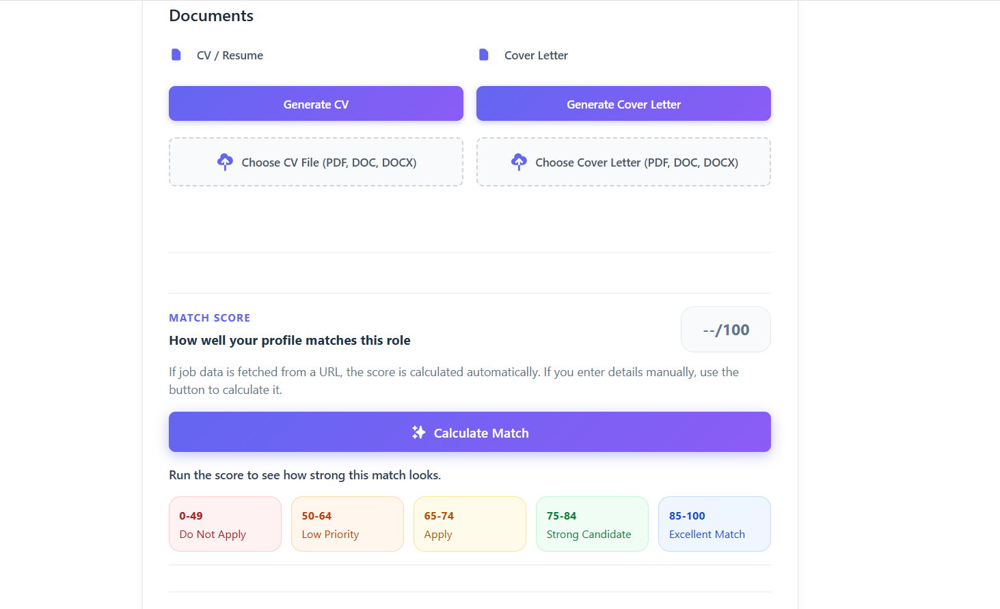
*Generate CV / Cover Letter and Match Score section (profile vs role)*

#### Application Detail/Edit
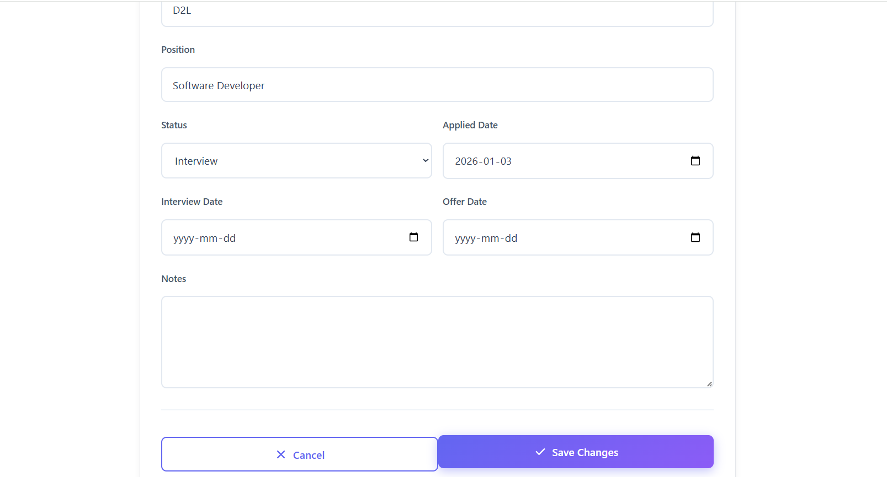
*Application detail page with status management and editing capabilities*

#### Login Page
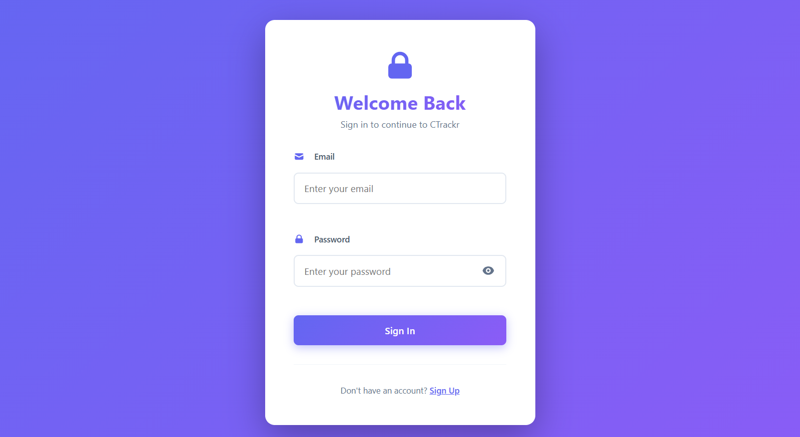
*Clean login interface with email/password authentication*

#### Create Account
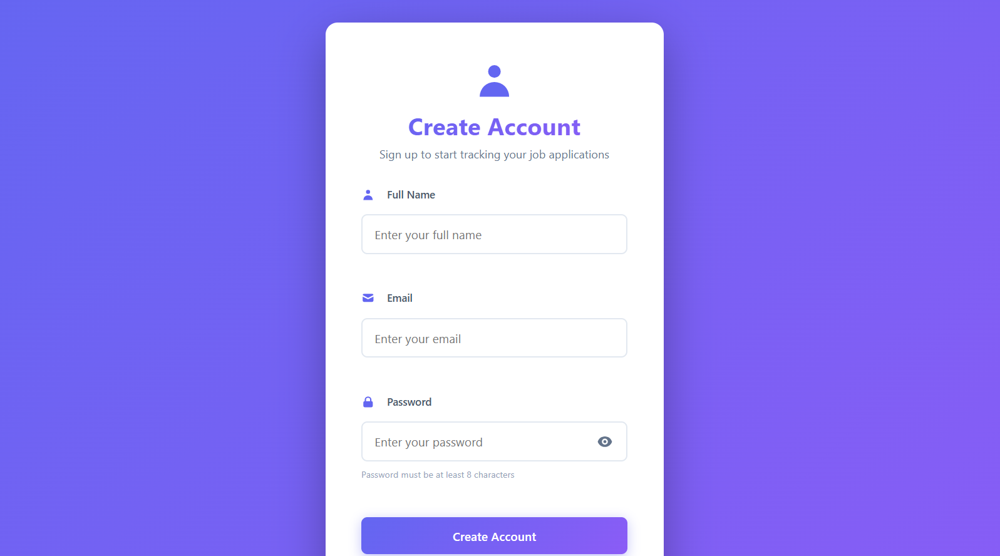
*User registration form with password requirements*

### Authentication Pages
- **Login Page**: Clean, modern login interface with email/password authentication
- **Create Account**: User-friendly registration form with password requirements
- **Email Verification**: Secure account verification via AWS Cognito

### Dashboard & Navigation
- **Home Page**: 
  - Hero section with clear call-to-action buttons
  - Feature highlights (Track Everything, Status Management, Easy Search)
  - Modern purple gradient design with intuitive navigation
- **Navigation Bar**: 
  - Responsive header with logo and main navigation links
  - User menu dropdown with profile and settings access
  - Mobile-friendly hamburger menu

### Application Management
- **Applications Dashboard**:
  - Summary statistics cards (Total Applications, In Interview, Offers)
  - Status filter tabs (All, Active, Applied, Interview, Offer, Rejected, Withdrawn, Accepted)
  - Search, applied-date range, and CSV export
  - Application cards with company, position, date, location, and document indicators
  - Interactive status dropdown for quick updates
- **New Application Form**:
  - Comprehensive form with company, position, dates, location, salary fields
  - Job posting URL with **extract** flow and **match score** against your profile
  - Job details section for descriptions and requirements
  - File upload areas for CV and Cover Letter with drag-and-drop support
  - Optional **AI-generated** CV/cover letter with version history alongside uploads
  - Real-time file upload progress and management
- **Application Detail/Edit**:
  - Modal or dedicated page for editing application details
  - Status management with dropdown selector
  - Date pickers for applied, interview, and offer dates
  - Notes section for additional information

### Profile Management
- **Profile Page**: 
  - Comprehensive profile editor with categorized sections
  - Skills management with categories and descriptions
  - Work experience, education, certifications, and projects sections
  - PDF generation for CV/Resume export

### Design System
- **Color Scheme**: Purple gradient primary colors with white backgrounds
- **Icons**: Consistent icon library (React Icons) throughout the application
- **Typography**: Clear hierarchy with bold headings and readable body text
- **Responsive Design**: Mobile-first approach with adaptive layouts
- **User Experience**: Intuitive navigation, clear visual feedback, and smooth interactions

## 🎨 Key Features in Detail

### File Upload System
- **Presigned URLs**: Secure, time-limited upload URLs
- **Structured Naming**: Automatic file naming with user ID, category, company, date, and time
- **Timezone Support**: Local timezone-aware file naming
- **Automatic Cleanup**: Files deleted when applications are removed
- **Versioning**: S3 versioning enabled for file recovery; application records can track **uploaded vs generated** document versions

### Job URL & fit analysis
- **Extract job info**: POST `/job-info` parses a posting URL to populate company, role, description, requirements, and contacts where possible
- **Match score**: POST `/match-score` returns a score, summary, strengths, and gaps for a profile–role pair

### AI document generation
- **Bedrock-backed**: `generate-documents` Lambda builds PDFs and stores them in the uploads bucket
- **UI entry points**: Dedicated `/generate-documents` and `/applications/:id/generate` routes, plus inline actions on the new-application flow

### Profile Management
- **Categorized Skills**: Organize skills into categories (e.g., "Frontend", "Backend", "DevOps")
- **Rich Text Support**: Detailed descriptions for experience, projects, etc.
- **PDF Export**: Generate professional CVs with all profile data
- **Real-time Updates**: Instant profile updates with DynamoDB

### Application Tracking
- **Status Workflow**: Track applications through multiple stages
- **Interview Scheduling**: Store interview details (date, time, place, link)
- **File Attachments**: Associate CV and cover letter with each application
- **Notes & Requirements**: Store job descriptions and requirements

## 🛠️ Technologies Used

### Frontend
- **React 18**: UI framework
- **TypeScript**: Type safety
- **Vite**: Build tool and dev server
- **React Router**: Client-side routing
- **jsPDF**: PDF generation
- **AWS Amplify**: Cognito integration
- **React Icons**: Icon library

### Backend
- **AWS Lambda**: Serverless compute (Node.js 20)
- **AWS API Gateway**: REST API (HTTP API)
- **AWS DynamoDB**: NoSQL database
- **AWS S3**: File storage
- **AWS CloudFront**: CDN
- **Amazon Bedrock**: Model inference for documents, job parsing, and match scoring
- **AWS Cognito**: Authentication
- **AWS SES**: Email service
- **AWS Route 53**: DNS management
- **AWS ACM**: SSL/TLS certificates
- **AWS IAM**: Access management

### Infrastructure
- **Terraform**: Infrastructure as Code
- **Archive Provider**: Lambda function packaging

## 📝 Environment Variables

### Frontend (.env)
```env
VITE_API_BASE_URL=https://api-gateway-url.execute-api.ca-central-1.amazonaws.com
VITE_COGNITO_USER_POOL_ID=ca-central-1_xxxxx
VITE_COGNITO_USER_POOL_CLIENT_ID=xxxxx
VITE_AWS_REGION=ca-central-1
```

### Terraform (terraform.tfvars)
See `terraform/terraform.tfvars.example` for a full example. Important values include:

```hcl
aws_region = "ca-central-1"
domain_name = "ctrackr.example.com"
ses_sender_email = "noreply@example.com"
project_name = "ctrackr"
environment = "prod"
bucket_name = "ctrackr-website-prod"
bedrock_model_id = "global.anthropic.claude-sonnet-4-5-20250929-v1:0"        # example — use models enabled in your account/region
bedrock_haiku_model_id = "anthropic.claude-3-haiku-20240307-v1:0"            # example — used for lighter parsing/scoring tasks
```

## 🚀 Deployment

### Frontend: GitHub Actions (automatic)

Pushes to the `main` branch trigger the workflow in `.github/workflows/deploy.yml`:

1. `npm install` + `npm run build` (Vite output in `dist/`)
2. `aws s3 sync dist/` to the website bucket (e.g. `ctrackr-website-prod`)
3. CloudFront invalidation for `/*`

Configure repository **Secrets**: `AWS_ACCESS_KEY_ID` and `AWS_SECRET_ACCESS_KEY` with permission to sync to the bucket and create invalidations. The workflow does **not** run Terraform or deploy Lambda code.

### Infrastructure & Lambda (Terraform, manual)

Terraform provisions API Gateway, DynamoDB, Cognito, S3, CloudFront, Lambda packages, and IAM. Run it when you change infrastructure or backend Lambda source:

```bash
cd terraform
terraform init
terraform apply
```

Lambda functions are packaged and uploaded by Terraform when you apply.

### Initial full setup (first time)

1. **Deploy infrastructure** (see above).
2. **Configure frontend env** (`.env` / production build) with `VITE_API_BASE_URL`, Cognito IDs, and region from Terraform outputs.
3. **Deploy frontend** either by pushing to `main` (recommended) or manually:
```bash
npm run build
aws s3 sync dist/ s3://ctrackr-website-prod --delete
aws cloudfront create-invalidation --distribution-id YOUR_DISTRIBUTION_ID --paths "/*"
```
Use `YOUR_DISTRIBUTION_ID` from `terraform output` (example: `E3OJLQS0UXAUC5`).

### Updating Frontend (manual alternative)

If you are not using GitHub Actions for a given build:

```bash
npm run build
aws s3 sync dist/ s3://ctrackr-website-prod --delete
aws cloudfront create-invalidation --distribution-id YOUR_DISTRIBUTION_ID --paths "/*"
```

## 🧪 Testing

### Manual Testing Checklist

- [ ] User registration and login
- [ ] Create new application
- [ ] Extract fields from a job posting URL (`/job-info`)
- [ ] Run match score against profile (`/match-score`)
- [ ] Generate AI CV or cover letter (`/generate-documents` or inline on new application)
- [ ] Upload CV and Cover Letter files
- [ ] Delete files from S3
- [ ] Update application details
- [ ] Filter applications by status, search, date range; export CSV
- [ ] Create and update user profile
- [ ] Generate PDF CV from profile
- [ ] Delete application (should also delete S3 files)

## 📊 Terraform Outputs

After deployment, Terraform provides the following outputs:

- `api_gateway_url` - API Gateway endpoint URL
- `dynamodb_table_name` - Applications table name
- `dynamodb_user_profiles_table_name` - User profiles table name
- `s3_bucket_name` - Website bucket name
- `s3_uploads_bucket_name` - Uploads bucket name
- `s3_bucket_website_url` - S3 website URL
- `cloudfront_distribution_url` - CloudFront distribution URL
- `cloudfront_distribution_id` - CloudFront distribution ID
- `cognito_user_pool_id` - Cognito User Pool ID
- `cognito_user_pool_client_id` - Cognito User Pool Client ID
- `cognito_user_pool_domain` - Cognito User Pool Domain

## 🤝 Contributing

1. Fork the repository
2. Create your feature branch (`git checkout -b feature/AmazingFeature`)
3. Commit your changes (`git commit -m 'Add some AmazingFeature'`)
4. Push to the branch (`git push origin feature/AmazingFeature`)
5. Open a Pull Request

## 📄 License

MIT

## 👤 Author

Sinan Cirak

## 🙏 Acknowledgments

- AWS for serverless infrastructure
- React team for the amazing framework
- Terraform for Infrastructure as Code
- All open-source contributors
